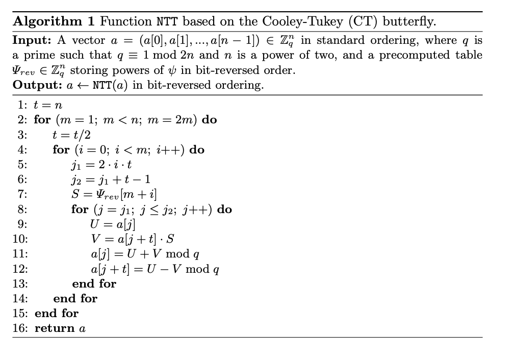
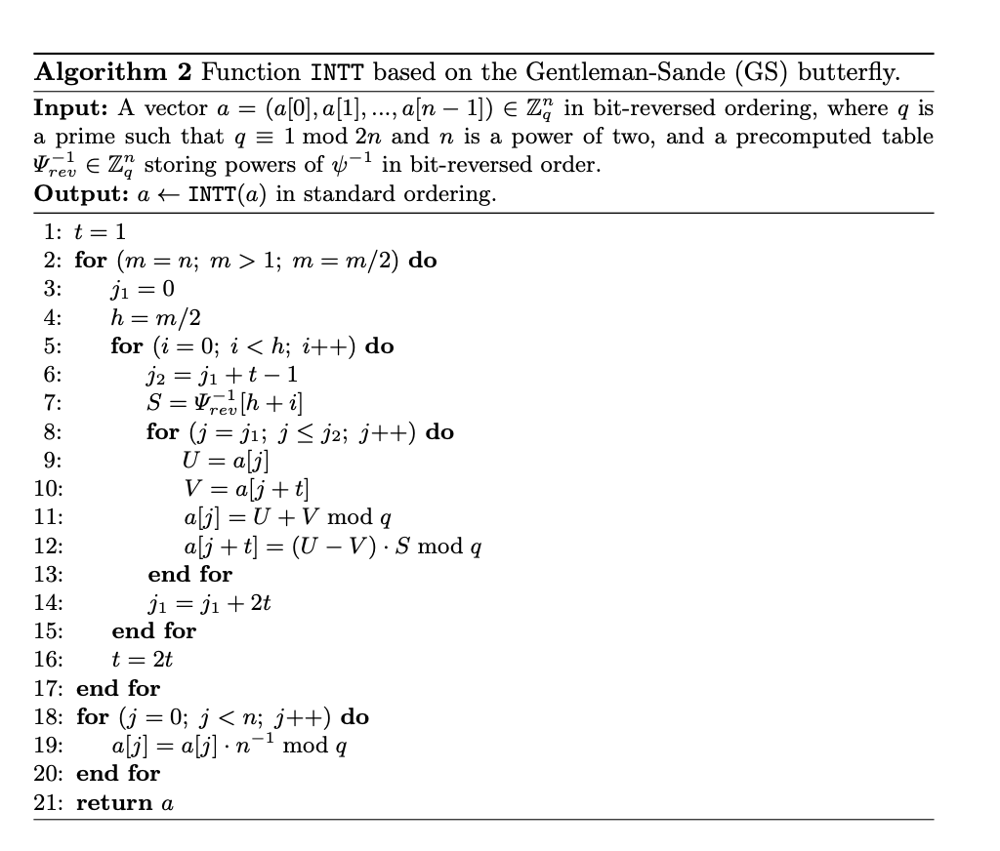

# NTT

This repository contains the EIP for NTT transform, along with a python reference code, and a solidity implementation.

## Context 

### The threat
With the release of Willow cheap, the concern for quantum threat against Ethereum seems to accelerate. Post by [Asanso](https://ethresear.ch/t/so-you-wanna-post-quantum-ethereum-transaction-signature/21291) and [PMiller](https://ethresear.ch/t/tidbits-of-post-quantum-eth/21296) summarize those stakes and possible solutions. Those solutions include use of lattice based signatures such as Dillithium or FALCON (the latter being more optimized for onchain constraints), STARKs and FHE. There is a consensus in the cryptographic research community around lattices as the future of asymetric protocols, and STARKs won the race for ZKEVMs implementation (as used by Scroll, Starknet and ZKsync).

Those protocols have in common to require fast polynomial multiplication over prime fields, and use NTT (a special [FFT](https://vitalik.eth.limo/general/2019/05/12/fft.html) adapted to prime fields). While in the past Montgomery multipliers over elliptic curve fields were the critical target of optimizations (both hardware and software), NTT optimization is the key to a performant PQ implementation.

### Discussion

In the past Ethereum chose specificity by picking secp256k1 as its sole candidate for signature. Later, after dedicated hardware and proving systems working on other hardwares were realeased, a zoo of EIP flourished to propose alternative curves. There where attempt to have higher level EIPs to enable all of those at once, such as EWASM, SIMD, EVMMAX,  or RIP7696 (by decreasing order of genericity and complexity).

Picking NTT as EIP instead of a given scheme would provide massive gas cost reduction for all schemes relying on it.
- **pros** : massive reduction to all cited protocols, more agility for evolutions.
- **cons**: still requires to be wrapped into larger implementation, not optimal for a given target compared to dedicated EIP, probably not stateless.

## Overview

The NTT operates on sequences of numbers (often coefficients of polynomials) in a modular arithmetic system. It maps these sequences into a different domain where convolution operations (e.g., polynomial multiplication) become simpler and faster, akin to how FFT simplifies signal convolution. Compared to FFT which uses root of unity in complex plane, NTT uses roots of unity in a finite field or ring. 

The NTT is based on the Discrete Fourier Transform (DFT), defined as:
$$
X[k] = \sum_{j=0}^{N-1} x[j] \cdot \omega^{j \cdot k} \mod q$$

Where:
- $x[j]$: Input sequence of length N.
- $X[k]$: Transformed sequence,
- $q$: A prime modulus,
- $\omega$: A primitive N-th root of unity modulo $q$, with
$\omega^N \equiv 1 \mod q \quad \text{and} \quad \omega^k \not\equiv 1 \mod q \; \forall \; 0 < k < N$

NTT computation uses the a similar approach as Cooley-Tukey algorithm to provide a O(N log N) complexity. The NTT algorithm transforms a sequence $(x[j])$ to $(X[k])$ using modular arithmetic. It is invertible, allowing reconstruction of the original sequence via the Inverse NTT (INTT). The inverse process is similar but requires dividing by \(N\) (mod \(q\)) and using $(\omega^{-1}$) (the modular inverse of $\omega$). The following algorithm is extracted from 
[[LN16]](https://eprint.iacr.org/2016/504.pdf), and describe how to compute the NTT when $R_q= \mathbb{Z}_q[X]/X^n+1$ (Negative Wrap Convolution).

The Inverse NTT is computed through the following algorithm:

## Benchmarks

### Python

### Solidity

| Function                   | Description               | gas cost | Tests Status |
|------------------------|---------------------|---------------------|---------------------|
| NTT recursive       | original gas cost from [falcon-solidity](https://github.com/Tetration-Lab/falcon-solidity/blob/main/src/Falcon.sol)         |  | OK|
| InvNTT recursive          | original gas cost from [falcon-solidity](https://github.com/Tetration-Lab/falcon-solidity/blob/main/src/Falcon.sol)  | | OK|
| Full FalconSol verification          | original gas cost from [falcon-solidity](https://github.com/Tetration-Lab/falcon-solidity/blob/main/src/Falcon.sol)  | 24 M| OK|
| NTT iterative      | ZKNOX  |   | OK|
|  InvNTT iterative       | ZKNOX |  | OK|
| Full FalconSol verification          | ZKNOX  | 9.5 M| OK|

## Conclusion

## References

[[LN16]](https://eprint.iacr.org/2016/504.pdf) Speeding up the Number Theoretic Transform
for Faster Ideal Lattice-Based Cryptography. Patrick Longa, Michael Naehrig